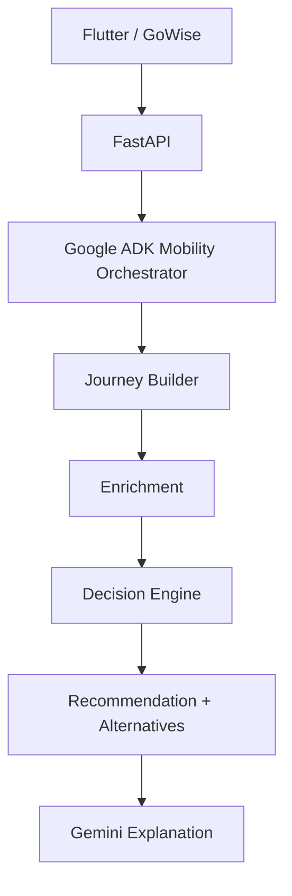

# Commute Agent

> **GoWise — Your commute, intelligently composed.**

Commute Agent is an adaptive AI commute agent that composes personalized multimodal journeys instead of simply finding a single route.

Built for Bengaluru, it combines walking, BMTC, BMRCL Metro, auto-rickshaws and cabs, then evaluates possible journeys using commuter preferences, constraints and contextual signals.

## ✨ Key capabilities

- 🧭 Multimodal journey discovery
- 🧠 Deterministic preference-based decision engine
- 📊 Historical mobility signals
- 🌐 Google Maps routing and location enrichment
- 🤖 Grounded Gemini explanations
- 🔄 Adaptive replanning
- 🗺️ Google Maps navigation handoff

## 🏗️ Architecture



> ADK orchestrates the workflow, while deterministic components remain authoritative for journey discovery, constraints and ranking.

## ☁️ Built with

| Layer | Technology |
|---|---|
| Application | Flutter / GoWise |
| Agent orchestration | Google ADK |
| AI | Gemini |
| Backend | FastAPI |
| Deployment | Google Cloud Run |
| Routing & Places | Google Maps Platform |
| Mobility data | BMTC + BMRCL |
| Historical ML | Historical mobility model |

## 🚀 Run locally

**API**

```bash
python3 -m venv .venv
source .venv/bin/activate
pip install -r requirements.txt
cp .env.example .env   # set GOOGLE_MAPS_API_KEY; optionally GOOGLE_GENAI_API_KEY
uvicorn src.api.app:app --host 0.0.0.0 --port 8000
```

**GoWise (Flutter)** — from `src/app/`

```bash
fvm flutter pub get

# Android emulator → host API
fvm flutter run --dart-define=API_BASE_URL=http://10.0.2.2:8000

# iOS simulator / desktop
fvm flutter run --dart-define=API_BASE_URL=http://127.0.0.1:8000
```

Without `--dart-define`, GoWise defaults to the deployed Cloud Run API.

## 🎬 Demo

**Choose origin & destination → select preferences → compose commute → compare alternatives → understand why → replan → navigate**

## 🌱 Vision

> Commute Agent turns route finding into mobility decision-making — choosing not just where to go, but how you should get there.
