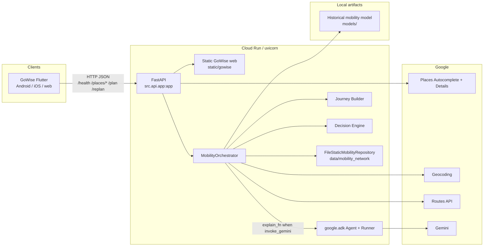
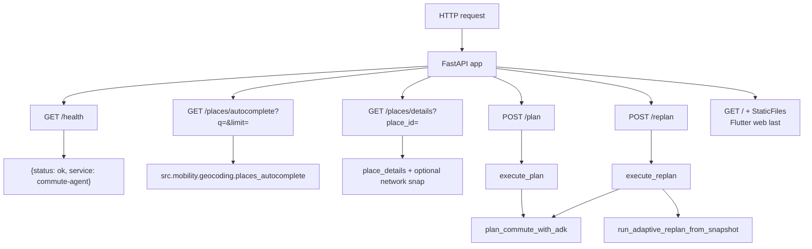
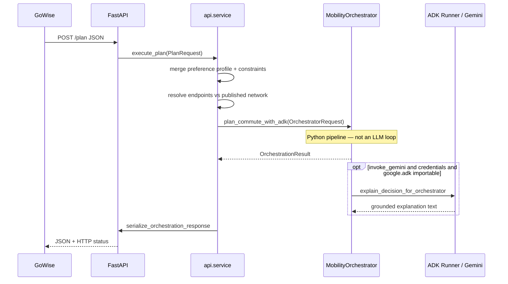
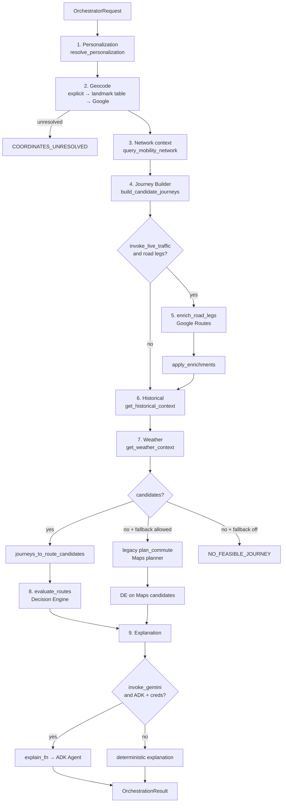
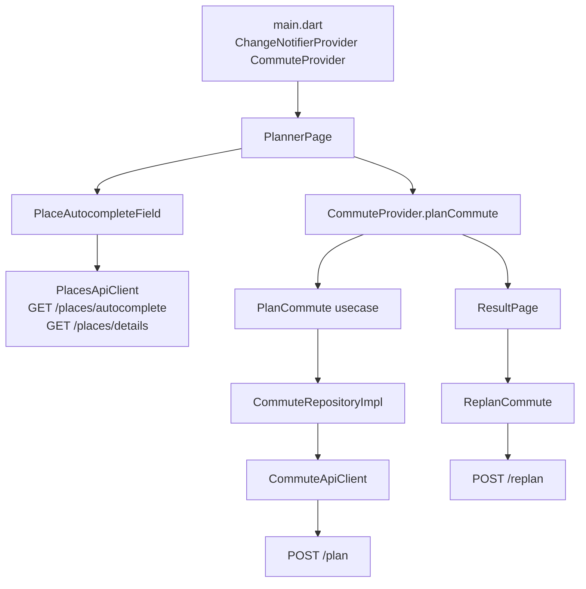
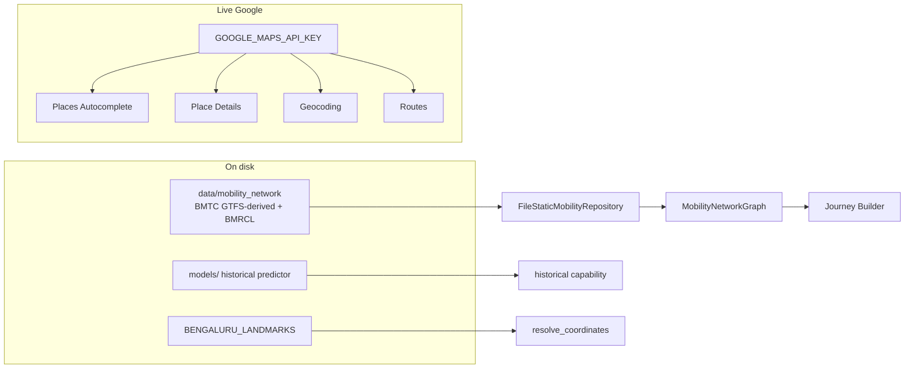
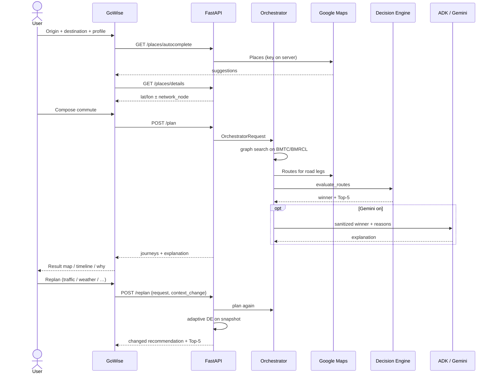

# Commute Agent architecture

GoWise (Flutter) talks only to FastAPI. FastAPI plans via a **deterministic Mobility Orchestrator** (`plan_commute_with_adk`). Google ADK + Gemini **explain** the Decision Engine winner; they never rank journeys.

```
Flutter / GoWise  →  FastAPI (src.api.app)  →  MobilityOrchestrator
                                              ├─ Journey Builder (BMTC/BMRCL graph)
                                              ├─ Maps enrichment (road legs)
                                              ├─ Historical + weather (optional)
                                              ├─ Decision Engine (authoritative rank)
                                              └─ ADK Agent + Gemini (explanation only)
```

---

## 1. System context



**Deploy:** `Dockerfile` runs `uvicorn src.api.app:app` on `$PORT` (Cloud Run default 8080). Image includes `src/`, `data/mobility_network`, `models/`, and `static/gowise`.

**Local:** `uvicorn src.api.app:app --host 0.0.0.0 --port 8000`. Flutter points at that host via `--dart-define=API_BASE_URL=...`.

---

## 2. Authority split (non-negotiable)

| Concern | Owner | Gemini / ADK |
|---|---|---|
| Discover candidate journeys | Journey Builder (A* on published network graph) | No |
| Rank / pick BEST_OVERALL + Top-5 | Decision Engine `evaluate_routes` | No |
| Hard constraints, strategy, excluded modes | Personalization + DE strategy filters | No |
| Live road times on access/egress | Google Routes via `enrich_road_legs` | No |
| User-facing “why this commute” copy | Optional ADK explanation | Yes, grounded in DE output |
| Invent routes, times, fares, traffic | Forbidden | Forbidden |

If Gemini is missing, ADK import fails, or explanation is empty → deterministic fallback string (`FALLBACK_NOTICE`). Ranking is unchanged.

---

## 3. FastAPI surface

Entry: `src/api/app.py` → `create_app()` → module-level `app`.

CORS is open (`allow_origins=["*"]`) for Flutter web. Heavy planner imports are **deferred inside handlers** so `/health` and `/places/*` stay cheap on Cloud Run cold start.



### Status mapping (`_status_for_payload`)

| Payload `error` | HTTP |
|---|---|
| none | 200 |
| `COORDINATES_UNRESOLVED`, `INVALID_*` | 400 |
| `NO_ROUTES`, `NO_VALID_ROUTES`, `NO_FEASIBLE_JOURNEY`, `NO_CANDIDATES` | 404 |
| `MAPS_API_UNAVAILABLE` | 502 |
| other | 500 |

### Request schemas (`src/api/schemas.py`)

**POST `/plan`** (`PlanRequest`): origin/destination labels, optional ISO `departure_time`, `preference_profile` / `objective`, `strategy`, `constraints`, lat/lon or `origin_endpoint` / `destination_endpoint` (`place` | `network_node`), weights, flags:

- `invoke_gemini` (default true)
- `invoke_weather`, `invoke_historical`
- `invoke_live_traffic` (default true in service)
- `allow_legacy_maps_fallback` (default true)

**POST `/replan`**: nested original `request` + `context_change` + `refresh_live_routes` + `invoke_gemini`.

---

## 4. How the API is wired to the orchestrator



`execute_plan` (`src/api/service.py`):

1. `default_mobility_repository()` → `FileStaticMobilityRepository("data/mobility_network")` if BMTC/BMRCL snapshots exist.
2. `orchestrator_request_from_plan(body)` maps HTTP → `OrchestratorRequest` (landmarks, explicit coords, Places endpoints, strategy, merged excluded modes).
3. `plan_commute_with_adk(...)`.
4. JSON: `recommended_journey`, `top_journeys` / `top_selection`, `decision`, `provenance`, `gemini` meta (`available`, `invoked`, `adk_invoked`, `mode`).

`execute_replan`:

1. Same orchestrator plan (optionally skip live traffic).
2. `snapshot_from_orchestration(orch)`.
3. `run_adaptive_replan_from_snapshot` (deterministic DE re-rank on context overlay).
4. Response `orchestration: "adk_adaptive_replan"`.

---

## 5. Mobility Orchestrator (what “ADK” means on `/plan`)

**Name vs implementation:** HTTP planning is **not** “Gemini calls tools until a route appears.” It is a fixed Python sequence in `MobilityOrchestrator.run` (`src/agent/orchestrator.py`). The public function is `plan_commute_with_adk`.



### Capability modules (`src/agent/capabilities/`)

| Step | Module | Role |
|---|---|---|
| Personalization | `personalization.py` | Preferences → `JourneyConstraints` + transfer cap |
| Network | `network.py` | Nearby stops/stations + snapshot versions |
| Journey | `journey.py` | `DynamicJourneyBuilder` graph search |
| Traffic | `traffic.py` | Maps Routes on legs that declare `enrichment_requirements` |
| Enrichment apply | `enrichment_apply.py` | Write times back onto journeys |
| Historical | `historical.py` | Zone/hour ML signal when coverage exists |
| Weather | `weather.py` | Optional; often `unavailable` |
| Adapt | `adapt.py` | `Journey` → `RouteCandidate` for DE |

Metadata (`OrchestrationMetadata`) records each capability: invoked / skipped / failed / unavailable. That list is returned in `provenance.capabilities`.

### Journey Builder (`src/journey_builder/`)

- Graph from published BMTC + BMRCL snapshots (`build_mobility_graph`).
- Goal-directed A* with route-continuation; **no LLM, no live Maps inside search**.
- Access/egress may be walk / auto / cab; those road legs get Maps enrichment **after** search.
- Economics / fares from network ingest (e.g. BMRCL fare tables), not Gemini.

### Decision Engine (`src/decision_engine/`)

`evaluate_routes`: hard constraints → strategy tiers → normalize → weighted utility → reason codes → categories → `select_top_journeys` (diverse Top-5). Gemini cannot change this list.

---

## 6. How Google ADK actually runs

Two different “ADK” surfaces exist. Production `/plan` uses **(B)** only.

### A. ADK Agent definition (`src/agent/planner.py`)

```python
Agent(
    name="commute_planner_agent",
    model=GEMINI_MODEL or "gemini-3.6-flash",
    instruction=SYSTEM_INSTRUCTION,
    tools=adk_tool_functions(),
)
```

Tools (`src/agent/tools.py`) are Python functions with primitive signatures so `google.adk.tools.FunctionTool` can declare them:

| Tool | Wraps |
|---|---|
| `plan_commute` | Legacy Maps `planner.service.plan_commute` |
| `plan_commute_with_adk_tool` | Same orchestrator as HTTP `/plan` |
| `query_mobility_network_tool` / `build_journeys_tool` | Network + builder |
| `get_routes` | Maps candidate routes |
| `evaluate_routes` | Decision Engine |
| `predict_historical_travel_time` | Historical model |
| `get_weather` / `get_disruptions` / `get_user_preferences` / `get_commute_history` / `save_feedback` | Mostly stubs / not_configured |

`SYSTEM_INSTRUCTION` (`src/agent/prompts.py`): tools + DE are fact sources; Gemini must not invent mobility facts or override ranking.

### B. Explanation runner (what `/plan` calls)

When `invoke_gemini` is true and caller did not inject `explain_fn`, `plan_commute_with_adk` injects `explain_decision_for_orchestrator`.

```mermaid
flowchart LR
  DE[Decision Engine winner] --> SAN["_sanitized_selected_journey<br/>no IDs / scores"]
  SAN --> MSG[User Content JSON<br/>+ EXPLANATION_INSTRUCTION]
  MSG --> RUN["_run_adk_explanation_message"]
  RUN --> ENV["_ensure_genai_env<br/>GOOGLE_API_KEY / GENAI key"]
  ENV --> AG[build_adk_agent]
  AG --> SES["InMemorySessionService.create_session_sync"]
  SES --> RR["Runner.run_async"]
  RR --> EV[ADK events]
  EV --> TXT["concat part.text"]
  TXT --> ORCH[explanation on AgentRecommendation]
```



Credentials (`src/agent/config.py`):

- Key: `GOOGLE_GENAI_API_KEY` | `GEMINI_API_KEY` | `GOOGLE_API_KEY`
- Or Vertex: `GOOGLE_GENAI_USE_VERTEXAI` + `GOOGLE_CLOUD_PROJECT`
- ADK present: `import google.adk.agents` (`adk_importable()`)

Failure modes never claim `gemini.invoked=true`. Modes: `adk_gemini` vs `deterministic_fallback`.

### C. Why tools exist if `/plan` does not loop the agent

The Agent is built with the full tool list so a **chat / NL** path (`parse_intent_from_text` + Runner) can call the same services. HTTP GoWise is structured JSON; it skips intent LLM and runs the orchestrator directly. Explanation still constructs that Agent (tools attached) but the prompt says ranking is already done.

---

## 7. Flutter / GoWise wiring

Clean architecture inside `src/app/lib/`:

```
presentation  →  domain usecases  →  repository  →  data  →  HTTP
```



| Piece | Path | Job |
|---|---|---|
| Config | `core/config/app_config.dart` | `API_BASE_URL` dart-define; Android debug → `10.0.2.2:8000`; else Cloud Run URL; `relative` = same origin |
| Places | `data/places_api_client.dart` | Autocomplete + details; Maps key stays on server |
| API | `data/datasources/commute_api_client.dart` | `/health`, `/plan`, `/replan`, 120s timeout |
| Repo | `data/repositories/commute_repository_impl.dart` | Entity ↔ JSON body |
| State | `presentation/providers/commute_provider.dart` | Loading / plan / replan; keeps last plan body for `/replan` |
| Screens | `planner_page.dart`, `result_page.dart` | Compose OD + prefs; map, Top-5, explanation, replan, Maps handoff |

Places flow: type → `/places/autocomplete` → pick → `/places/details` → lat/lon + optional `network_node` → `/plan` `origin_endpoint` / `destination_endpoint`.

Web on Cloud Run: FastAPI mounts `static/gowise` **last** (`src/api/static_web.py`) so API routes win. Flutter can use empty base URL (`API_BASE_URL=relative`) so requests are same-origin `/plan`.

---

## 8. Data and external I/O



Maps API key is **server-side only**. Flutter never sees it.

Legacy fallback: if Journey Builder returns no candidates and `allow_legacy_maps_fallback`, `planner.service.plan_commute` uses Maps-only candidates. Response `orchestration` stays `adk_mobility_orchestrator` unless that legacy serializer is used (`legacy_maps_planner`).

---

## 9. End-to-end: one commute



---

## 10. Key files

| Layer | Files |
|---|---|
| HTTP | `src/api/app.py`, `schemas.py`, `service.py`, `static_web.py` |
| Orchestrator | `src/agent/orchestrator.py`, `capabilities/*`, `adaptive/` |
| ADK / Gemini | `src/agent/planner.py`, `tools.py`, `prompts.py`, `config.py` |
| Search | `src/journey_builder/builder.py`, `graph.py`, `endpoints.py` |
| Rank | `src/decision_engine/evaluator.py`, `scoring.py`, `strategy.py`, `top5.py` |
| Network | `src/network/file_repository.py`, `endpoint_resolve.py` |
| Maps | `src/mobility/geocoding.py`, `maps_client.py`, `service.py` |
| Flutter | `src/app/lib/main.dart`, `core/config/app_config.dart`, `data/*`, `presentation/*` |
| Deploy | `Dockerfile`, `requirements.txt` |

---

## 11. Mental model

```
GoWise is a thin client.
FastAPI is the only public contract.
plan_commute_with_adk is a deterministic pipeline named for the ADK era.
google.adk is a Gemini wrapper with tools; HTTP uses it for explanation after DE.
Journey Builder finds; Decision Engine chooses; Gemini talks.
```
